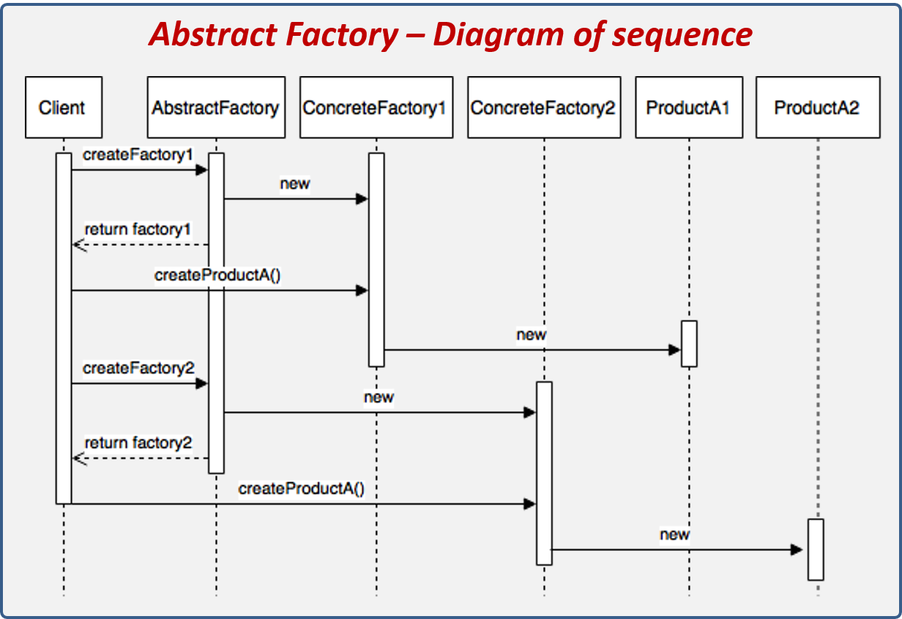
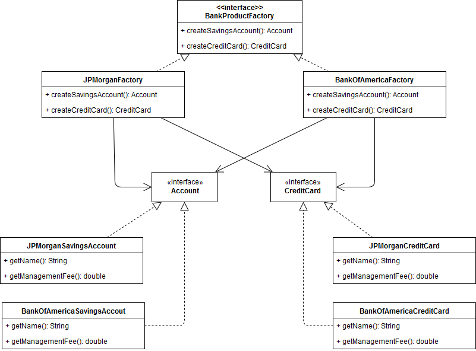

# Abstract Factory Design Pattern
It's a **CREATIONAL** design pattern which tries to group a set of classes with similar behaviour called _families_ 
which in turn are created by **factories**.  

This means that you're going to have different **factories** of related or dependant objects without specifying their
concrete classes. 
 

#### General concept

I know this is difficult to understand! but:
* **Client**: simple, the client code that triggers the pattern execution.
* **AbstractProduct(A,B)**: Interfaces that define the _abstraction_ of the objects to create families.
* **ConcreteProduct(A,B)**: Classes that implement the AbstractProduct.
* **ConcreteFactory**: Represent the concrete factories, basically, the different product families.
* **AbstractFactory**: Defines the factories structure and must have a method for each family class.

Let's see a diagram of sequence to better understanding:

#### Advantages
* Isolate concrete classes: The pattern encapsulates the responsibility and the creation process of concrete products.
* Product families easy to change: Since the abstract factories create a complete family of products, is easier to change
all the family.

#### Disadvantages
* Adding new products can be challenging since we need to modify the AbstractFactory class and all of its subclasses.

#### In this example
In this example, we're going to use the **Abstract Factory** design pattern to deal with management fees on products :
* Savings account
* Credit card

So that, our abstract factory is going to return the corresponding products based on the bank. 

