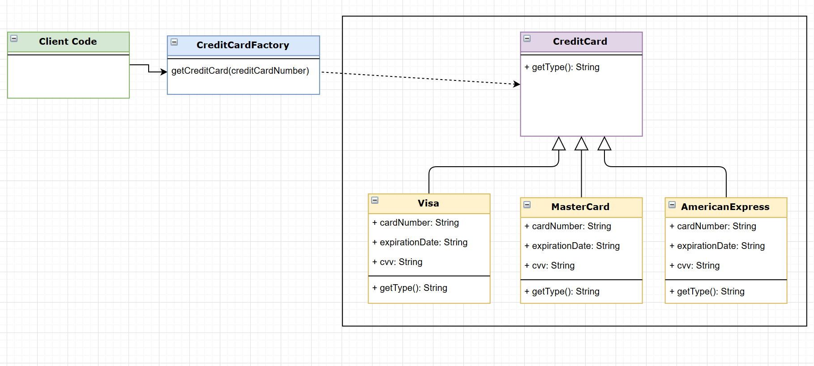

# Factory Design Pattern
It's a **CREATIONAL** design pattern which defines an interface for creating an object but let the subclasses decide 
which class to instantiate.

It means that, based on a set of related classes, we have to create an interface with the common methods of those classes
 and then, create a "factory" class which is gonna be in charge of instantiating the related classes based on a condition.
 

#### General concept

#### Advantages

#### In this example
In this example, we're going to use the factory design pattern to deal with credit card franchises:
* Visa
* MasterCard
* American Express

So that, our factory method is going to return an instance of one of those cards based on the credit card number.

